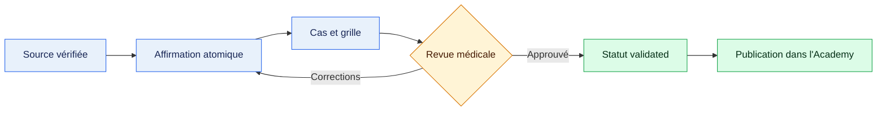

# Audit du contenu médical — pilote endomètre

*Audit interne du 31 juillet 2026 — périmètre éducatif, non destiné à une utilisation clinique directe*

---

## 🧾 Verdict

Le pilote constitue une **bonne ossature pédagogique**, mais le contenu initial ne pouvait pas être considéré comme validé. Les principales limites étaient l'absence de traçabilité affirmation-source, des identifiants incohérents entre curriculum, graphe, cas et questions, ainsi qu'un premier cas trop peu déterministe pour produire un feedback reproductible.

La boucle `endo_case_001_lvsi_reasoning` est désormais structurée et fondée sur des sources vérifiées. Elle reste au statut `needs_review` jusqu'à validation médicale explicite par Sami.

## 🔎 Méthode

L'audit a couvert :

- le curriculum, le graphe de prérequis et les identifiants ;
- les dix capsules existantes ;
- les cinq cas et cinq questions initiaux ;
- l'index des sources et l'accès au texte intégral ;
- la cohérence entre affirmation, profil de rechute, outil thérapeutique et niveau de preuve.

La recommandation ESGO-ESTRO-ESP 2025 et son annexe ont été vérifiées en texte intégral localement. Les métadonnées des recommandations et essais structurants ont été vérifiées dans PubMed. Les textes intégraux SFRO 2025 et GINECO 2026 restent à obtenir avant extraction détaillée.

## ✅ Corrections réalisées

| Domaine | Problème initial | Correction |
|---|---|---|
| Identifiants | Plusieurs noms pour le même concept | Identifiants harmonisés dans curriculum, graphe, cas et questions |
| LVSI | Formulation descriptive sans définition opérationnelle | Distinction focal/substantiel et seuil opérationnel documentés |
| Groupes de risque | Catégories trop génériques | Risques ESGO-ESTRO-ESP 2025 et séparation stade/groupe/traitement |
| Outils de RT | Curiethérapie et RT pelvienne opposées de façon simpliste | Raisonnement par volume traité et profil de rechute |
| Premier cas | Réponse attendue non reproductible | Données disponibles, critères, grille 0–2, erreurs et remédiation |
| Re-test | Absent | Question de transfert dédiée créée |
| Sources | Index de départ incomplet | Index enrichi avec DOI, PMID, niveau d'accès et concepts concernés |
| Gouvernance | Statut global imprécis | Aucun contenu promu au-delà de `needs_review` sans revue clinique |

## ⚕️ Points médicaux essentiels

1. **Le LVSI doit être gradué.** L'annexe ESGO-ESTRO-ESP 2025 retient un système à trois niveaux et décrit le LVSI substantiel par l'atteinte d'au moins cinq vaisseaux sur au moins une lame H&E ; un seuil de quatre est également rapporté comme acceptable lorsque la différence pronostique entre quatre et cinq est faible.[^esgo-appendix]
2. **Le LVSI substantiel n'est pas une prescription isolée.** Il modifie le stade et/ou la stratification selon le contexte, mais doit être interprété avec l'histologie, le grade, l'extension, le statut ganglionnaire et la classe moléculaire.[^esgo-2025]
3. **Stade, groupe pronostique et traitement sont trois opérations distinctes.** Les groupes ESGO-ESTRO-ESP 2025 sont définis par des risques de récidive à cinq ans : faible `<8 %`, intermédiaire `8–14 %`, intermédiaire-haut `15–24 %`, élevé `≥25 %`.[^esgo-2025]
4. **Curiethérapie vaginale et RT pelvienne ne préviennent pas exactement le même événement.** PORTEC-2 soutient le contrôle vaginal durable de la curiethérapie dans une population à risque intermédiaire-haut sélectionnée, avec davantage de récidives pelviennes dans le groupe curiethérapie, bien que les récidives pelviennes isolées restent rares.[^portec2]
5. **Le profil moléculaire ne doit pas être réduit à une étiquette histologique.** En particulier, `p53abn` n'est pas synonyme de carcinome séreux. La classification moléculaire apporte une information pronostique et potentiellement prédictive qui complète la morphologie.[^portec-molecular]
6. **PORTEC-4a est une preuve émergente importante, pas une autorisation à généraliser sans contexte.** L'essai randomisé publié en 2026 étudie une stratégie adjuvante guidée par le profil moléculaire chez des patientes à risque intermédiaire-haut ; son intégration pédagogique doit conserver les critères d'éligibilité et le caractère récent des résultats.[^portec4a]

## 🚨 Contenu restant à corriger

- Les quatre autres cas sont encore des brouillons : ils ne possèdent ni données structurées complètes, ni grille déterministe, ni re-test.
- Six capsules restent trop courtes ou partiellement anglophones.
- Les nœuds `figo_2023_staging`, anatomie, grade, bilan diagnostique, doses, volumes, OAR et toxicités n'ont pas encore de capsule dédiée.
- Les recommandations françaises détaillées de radiothérapie ne doivent pas être extrapolées à partir du seul résumé SFRO.
- La capsule dMMR/MSI doit séparer biologie, dépistage de Lynch, contexte adjuvant et maladie avancée/récidivante.
- Les schémas de dose, fractionnements, délinéation et contraintes ne sont pas encore audités et ne doivent pas être présentés comme validés.

## 🔄 Chaîne de validation

## 🧪 Critères de validation de la première boucle

La boucle LVSI pourra passer à `validated` lorsque :

- Sami aura accepté ou corrigé les quatre capsules liées ;
- le cas ne permettra aucune prescription définitive avec des données manquantes ;
- la grille et les erreurs critiques seront jugées cliniquement pertinentes ;
- le re-test mesurera un transfert de raisonnement et non une répétition textuelle ;
- les références utilisées seront traçables dans `sources/index.json` ;
- le validateur local ne signalera aucune erreur structurelle.

## 📋 Décisions attendues de Sami

1. Valider la formulation : « le LVSI substantiel augmente la préoccupation régionale et distante, mais n'est pas une indication thérapeutique isolée ».
2. Valider les données minimales exigées avant décision : grade, extension, marges, statut ganglionnaire, classe moléculaire et facteurs liés à la patiente.
3. Valider les cinq axes de la grille du cas LVSI et le seuil de maîtrise provisoire.
4. Valider le routage prioritaire vers une seule capsule avant le re-test.

Le détail opérationnel est suivi dans `review_queue.json`.

[^esgo-2025]: Concin N, et al. *ESGO-ESTRO-ESP guidelines for the management of patients with endometrial carcinoma: update 2025*. Lancet Oncol. 2025. https://pubmed.ncbi.nlm.nih.gov/40744042/
[^esgo-appendix]: ESGO-ESTRO-ESP. *Supplementary appendix to the 2025 endometrial carcinoma guideline*. https://guidelines.esgo.org/media/2025/09/Appendix-1.pdf
[^portec2]: Wortman BG, et al. *Ten-year results of the PORTEC-2 trial*. Br J Cancer. 2018. https://pubmed.ncbi.nlm.nih.gov/30356126/
[^portec-molecular]: Horeweg N, et al. *Molecular Classification Predicts Response to Radiotherapy in the Randomized PORTEC-1 and PORTEC-2 Trials*. J Clin Oncol. 2023. https://pubmed.ncbi.nlm.nih.gov/37487144/
[^portec4a]: de Boer SM, et al. *Molecular profile-based versus standard adjuvant radiotherapy in endometrial cancer (PORTEC-4a)*. Lancet Oncol. 2026. https://pubmed.ncbi.nlm.nih.gov/41449145/
