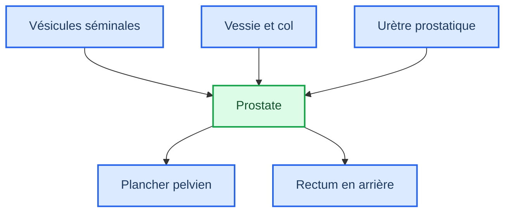
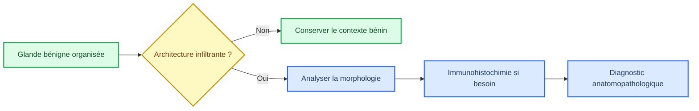
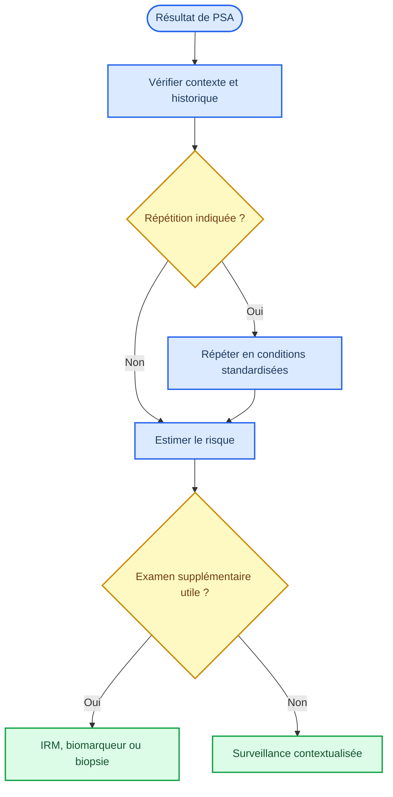
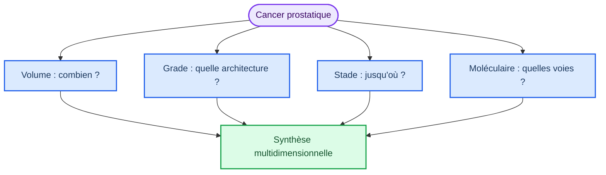
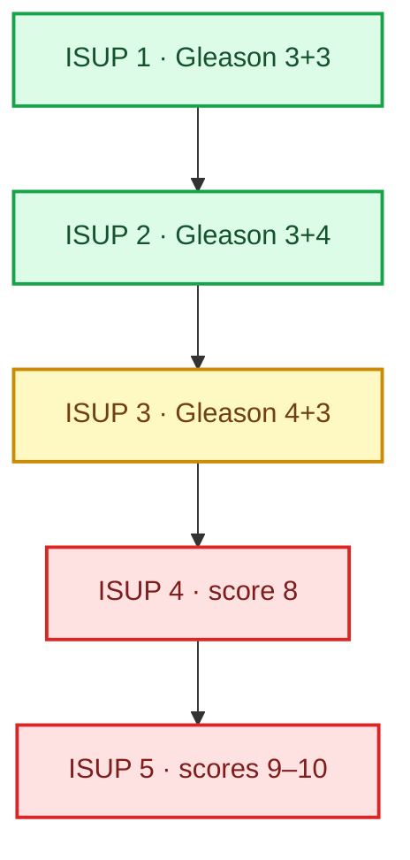

# Bloc 1 — sources textuelles des schémas

_OncoRT Academy · pilote Fondations prostate · version 0.2.0 · contenu `needs_review`_

---

## 📋 Règle éditoriale

Ces diagrammes constituent la source textuelle auditable des visuels relationnels du
bloc. L'interface les traduit en composants HTML/CSS accessibles et responsives ; elle
ne doit pas en modifier le raisonnement. Les représentations anatomiques sont
schématiques, non à l'échelle et impropres au contourage. L'anatomie zonale, le rôle du
récepteur aux androgènes, l'interprétation continue du PSA et le grading ISUP sont liés
aux sources affichées dans chaque leçon.[^1][^2][^3][^4]

## 📚 Anatomie relationnelle

## 📚 Histologie conceptuelle

## 📚 Axe androgénique

## 📚 Interprétation du PSA

## 📚 Dimensions tumorales

## 📚 Échelle Gleason–ISUP

---

[^1]: Fine, S. W., & Reuter, V. E. (2012). "Anatomy of the prostate revisited: implications for prostate biopsy and zonal origins of prostate cancer." _Histopathology_. https://pubmed.ncbi.nlm.nih.gov/22212083/

[^2]: Vickman, R. E., et al. (2020). "The role of the androgen receptor in prostate development and benign prostatic hyperplasia: A review." _Asian Journal of Urology_. https://pmc.ncbi.nlm.nih.gov/articles/PMC7385520/

[^3]: European Association of Urology. (2026). "EAU Guidelines on Prostate Cancer." https://uroweb.org/guidelines/prostate-cancer

[^4]: van Leenders, G. J. L. H., et al. (2020). "The 2019 International Society of Urological Pathology Consensus Conference on Grading of Prostatic Carcinoma." _American Journal of Surgical Pathology_. https://pmc.ncbi.nlm.nih.gov/articles/PMC7382533/
