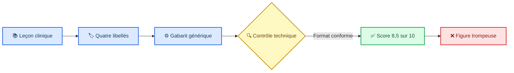

# Audit de pertinence scientifique des figures prostate

_OncoRT Academy · 91 figures · 15 blocs · 2 août 2026_

---

**Objet :** concordance entre l'objectif de la leçon, le contenu clinique, l'encodage visuel et le dispositif de validation. **Statut :** audit diagnostique ; aucune figure n'a été corrigée pendant cet audit.

> **Mise à jour post-audit — 2 août 2026 :** les constats ci-dessous décrivent le corpus initial. Une première remédiation complète a ensuite remplacé les 34 figures bloquantes, repris les relations trompeuses des familles majeures, corrigé les replis textuels et supprimé les faux scores de qualité. Les 91 figures restent `needs_review` : cette remédiation technique et éditoriale ne constitue pas une validation clinique nominative.

## ✅ État de la remédiation

- **34/34 figures initialement bloquantes remplacées par des rendus dédiés.** Les anatomies MICI/TURP/urinaire/digestive/lit postopératoire, les cartes de cibles, les courbes PSA/testostérone, les parcours moléculaires, les dashboards, le risque ganglionnaire et les cartes corporelles ne réutilisent plus un faux objet universel.
- **Bloc planification RT entièrement reconstruit.** La simulation montre préparation–reproductibilité–fusion ; les volumes distinguent anatomie, CTV, GTV-DIL éventuel et PTV ; les OAR sont nommés et reliés à leur définition source ; le DVH porte axes, unités, légendes, données synthétiques déclarées et jeux de contraintes séparés ; l'IGRT compare repères pelvien et prostatique ; l'audit utilise des cases non précochées et des sorties `corriger / autoriser`.
- **Courbes et valeurs non trompeuses.** Toute trajectoire est déclarée schématique ou synthétique. Les axes sont nommés ; aucune courbe n'est présentée comme donnée patient. Le PSADT montre une pente de `ln(PSA)` et sa formule, sans fabriquer de valeur individuelle.
- **Relations logiques assainies.** Les arbres sans vraies branches sont devenus des algorithmes séquentiels ; les parcours parallèles sont présentés comme axes à mettre en regard plutôt que comme alternatives imposées ; les calendriers affichent les schémas/durées réellement enseignés ou une boucle de cycle explicite.
- **13 figures spécifiques revues visuellement.** Les 12 PNG Fondations/Détection restent conservés après audit ciblé. Le workflow IRM–PI-RADS a été corrigé pour montrer une localisation zonale schématique plutôt qu'un simple texte « localisation ».
- **Contrôle automatique recadré.** Les notes numériques `8,5/10` ont été supprimées. Les logs automatiques vérifient désormais structure, traçabilité, repli textuel, absence de donnée patient et release gate, tout en déclarant explicitement qu'ils ne jugent pas la vérité clinique.
- **Garde-fous testés.** Un test dédié vérifie 34 ensembles de repères scientifiques propres aux anciennes figures bloquantes, l'unicité des quatre détails textuels des 78 figures avancées, l'absence de score clinique automatique et le maintien de `needs_review`.

Contrôles exécutés après remédiation : validation du corpus prostate, **55/55 tests**, TypeScript, build de production, **4/4 parcours Playwright**, et audit ciblé du bloc planification RT sur desktop/mobile. Le seul avertissement conservé concerne quatre nœuds curriculaires sans capsule, sans rapport avec les figures.

## 📋 Verdict exécutif

Le signalement est fondé. Les figures du bloc « planification radiothérapique » sur les volumes cibles et le DVH sont fausses ou trompeuses dans leur encodage, et le défaut touche une grande partie des 78 figures avancées.

Répartition provisoire des 78 figures avancées :

- **34 bloquantes** : pseudo-anatomie, pseudo-données ou spatialisation inventée ; retrait ou remplacement nécessaire ;
- **33 majeures** : relations décisionnelles, temporelles ou causales imposées sans être démontrées par le contenu ;
- **10 importantes** : forme globalement plausible, mais contenu trop générique pour enseigner la leçon ;
- **1 récupérable après révision ciblée** : la checklist d'audit prétraitement.

Les 13 figures spécifiques des blocs Fondations et Détection–diagnostic sont nettement plus pertinentes parce qu'elles ont été conçues individuellement. Elles restent néanmoins `needs_review` : l'audit visuel ne constitue pas une validation clinique, anatomique ou radiologique nominative.

La conclusion de release est simple : **les 78 figures avancées ne doivent pas être présentées comme un corpus pédagogique validé. Les 34 figures bloquantes doivent être masquées ou remplacées avant toute utilisation clinique ou enseignante.**

## 🔍 Méthode

Chaque figure a été confrontée à cinq questions :

1. Le visuel représente-t-il réellement l'objet annoncé par le titre ?
2. Les positions, formes, courbes, axes et flèches ont-ils un sens clinique défendable ?
3. Le visuel encode-t-il les faits de la leçon, ou seulement leurs intitulés ?
4. Une relation spatiale, temporelle, causale ou quantitative est-elle inventée ?
5. Les contrôles automatiques pouvaient-ils détecter une erreur scientifique ?

Échelle utilisée :

- **Bloquant** : risque d'apprentissage faux ou de mauvaise représentation clinique ;
- **Majeur** : message principal incomplet ou relation logique trompeuse ;
- **Important** : idée générale pertinente mais valeur pédagogique insuffisante ;
- **Récupérable** : structure appropriée, à compléter et faire revoir.

## ⚙️ Pourquoi les contrôles précédents ont échoué

Le précontrôle attribuait 8,5/10 sur des critères essentiellement techniques : canevas 16:9, titre et description, palette, présence de sources et badge `needs_review`. Il ne testait ni l'anatomie, ni les axes, ni la signification des courbes, ni la concordance des flèches, ni l'exactitude des relations cliniques.

Les causes racines sont documentées dans le code :

1. Les 78 figures avancées sont issues de **22 fonctions de rendu génériques** dans `scripts/render_prostate_visuals.mjs`.
2. Chaque fonction reçoit seulement les quatre `label` de `visual.items`. Le champ `detail`, qui contient le contenu clinique, n'est jamais utilisé dans le SVG.
3. Les 78 SVG ont des hash différents parce que leurs titres et libellés diffèrent ; cela ne prouve pas une conception visuelle spécifique.
4. Le test de diversité vérifie le nombre de types, l'unicité des fichiers et les métadonnées, pas la pertinence scientifique.
5. Dans les 78 leçons avancées, le détail du quatrième item répète celui du premier. Le générateur distribue quatre items sur seulement trois sections avec un modulo. Cette erreur est visible dans le repli textuel de l'interface.
6. Les affectations de type dans `visual_plan.json` ont été choisies au niveau du nom de la leçon, mais aucune spécification clinique figure par figure n'a été écrite avant le rendu.

## 📚 Analyse approfondie — planification radiothérapique

### 1. Simulation : fabriquer une anatomie reproductible — bloquant

**Figure actuelle :** le même bassin stylisé que dans six autres leçons, avec quatre flèches aboutissant à des zones arbitraires.

**Erreur :** la figure ne représente ni installation, ni immobilisation, ni préparation vessie/rectum, ni acquisition CT, ni fusion IRM. Les labels « préparation », « géométrie reproductible », « imagerie concordante » et « contourage fiable » sont projetés sur une anatomie sans relation avec les objets pointés.

**Remplacement pertinent :** deux ou trois panneaux : installation au scanner ; comparaison vessie/rectum conforme versus non conforme ; fusion CT–IRM avec repères de concordance.

### 2. Volumes cibles : du risque à une anatomie explicite — bloquant

**Figure actuelle :** quatre ellipses concentriques et un cercle, non légendés, présentés comme « carte GTV–CTV–PTV ».

**Erreurs :**

- aucune structure n'est identifiée comme prostate, vésicules, GTV, CTV ou PTV ;
- les flèches relient « indication », « CTV », « incertitudes » et « PTV » à des formes arbitraires ;
- les ellipses concentriques suggèrent une relation spatiale exacte qui n'est pas définie ;
- le cercle excentré peut être interprété comme une lésion dominante, mais rien ne le dit ;
- la figure mélange concepts oncologiques, anatomiques et marge géométrique.

Les référentiels de contourage définissent des volumes sur une anatomie CT/IRM et insistent sur la variabilité de délinéation ; un empilement d'ellipses abstraites ne peut pas remplacer cette représentation.[^1][^2]

**Remplacement pertinent :** coupe axiale pelvienne simplifiée mais anatomiquement cohérente, avec légende explicite prostate/CTV/PTV et OAR ; panneau séparé pour l'incertitude et la marge ; éventuelle lésion dominante clairement distinguée du CTV.

### 3. OAR : définir avant de mesurer — bloquant

**Figure actuelle :** reprise du bassin générique avec quatre flèches.

**Erreur :** aucun OAR n'est correctement contouré ou nommé. Les concepts « définition source », « DVH correspondant » et « interprétation valide » ne sont pas des structures anatomiques et ne doivent pas pointer vers le pelvis.

**Remplacement pertinent :** coupe axiale annotée montrant rectum/paroi rectale, vessie/paroi vésicale, têtes fémorales, bulbe pénien et, selon contexte, urètre ; encart expliquant pourquoi la définition de la structure conditionne le DVH.

### 4. DVH et distribution — bloquant

**Figure actuelle :** deux courbes décroissantes arbitraires, sans légende, sans graduations, sans unité de dose, sans identification des structures et sans origine des données.

**Erreurs :**

- les courbes ressemblent à des données réelles alors qu'elles sont inventées ;
- les points « protocole », « structures », « DVH » et « inspection spatiale » sont posés le long d'une courbe comme des étapes successives ;
- aucune distinction cible/OAR, aucun Vx/Dx, aucune prescription et aucune limite ne sont lisibles ;
- l'axe « DOSE » n'indique ni Gy ni pourcentage de dose prescrite ;
- le message essentiel — le DVH perd l'information spatiale — n'est pas démontré.

L'usage du DVH est intrinsèque à la planification IMRT et doit être associé à des définitions, unités et règles de QA explicites.[^3]

**Remplacement pertinent :** DVH cumulatif didactique construit à partir de données synthétiques vérifiées et déclarées, axes gradués et légendés, courbes PTV/rectum/vessie identifiées, annotations Vx/Dx ; second panneau de distribution spatiale montrant deux plans pouvant avoir un DVH proche mais une localisation différente du point chaud ou du sous-dosage.

### 5. IGRT : corriger la bonne cible au bon moment — bloquant

**Figure actuelle :** deux copies identiques du bassin et une flèche centrale.

**Erreur :** absence d'images de référence et du jour, d'overlay, de décalage os/prostate, de repère fiduciel, de cible ganglionnaire, de vecteur de correction et de mouvement intrafraction. Le visuel n'enseigne pas la difficulté de recalage.

**Remplacement pertinent :** superposition planification/CBCT avec deux recalages comparés — os versus prostate — et conséquence sur prostate et pelvis ; mini-frise acquisition, correction, contrôle intrafraction et action documentée. L'EAU rappelle que la planification IMRT/VMAT et l'IGRT forment une chaîne technique avec expertise et QA dédiées.[^4]

### 6. Audit de prétraitement — récupérable

La forme checklist est pertinente. Elle reste trop sommaire et affiche quatre cases déjà cochées, ce qui simule une validation plutôt qu'un contrôle. Elle doit devenir un vrai arbre `conforme / dérogation documentée / reprise`, avec identité, prescription, contours, calcul, couverture, contraintes, QA physique, IGRT et approbateur.

## 📊 Défauts par famille visuelle

| Famille | n | Gravité | Défaut dominant |
|---|---:|---|---|
| Anatomie générique | 7 | Bloquant | Même pelvis pour MICI, TURP, toxicité urinaire/digestive, lit postopératoire, simulation et OAR ; flèches sans correspondance anatomique. |
| Cartes de cibles | 5 | Bloquant | Ellipses identiques non légendées pour pelvis, boost, cN1, récidive ganglionnaire et GTV–CTV–PTV. |
| Cartes de mouvement | 2 | Bloquant | Deux pelvis identiques ; ni artefact de prothèse ni recalage IGRT réellement représentés. |
| Courbes | 5 | Bloquant | Courbes inventées sans données, unités, graduations ni légende ; cinétiques PSA/testostérone et DVH artificiels. |
| Cartes corporelles | 7 | Bloquant | Même silhouette avec halo abdominal pour santé sexuelle, os, psychosocial, métastases, radium, RT palliative et MDT multi-sites. |
| Couches emboîtées | 2 | Bloquant | TNM et construction EBRT réduits aux mêmes ellipses ; hiérarchie spatiale fictive. |
| Parcours moléculaires | 3 | Bloquant | Icônes génériques identiques ; aucune voie HRR–PARP, logique de test ou sélection PSMA réellement encodée. |
| Dashboards | 2 | Bloquant | Jauges décoratives sans mesure, unité, seuil ni temporalité. |
| Jauge ganglionnaire | 1 | Bloquant | Aiguille et probabilité graphiques inventées, sans valeur ni modèle. |
| Arbres décisionnels | 4 | Majeur | Un losange vers trois boîtes, même lorsque les trois labels ne sont pas des branches mutuellement exclusives. |
| Calendriers thérapeutiques | 4 | Majeur | Quatre icônes calendrier équidistantes ; aucun nombre de fractions, intervalle, cycle ou durée. |
| Frises | 5 | Majeur | Espacement uniforme donnant une temporalité factice ; durées et chevauchements absents. |
| Parcours parallèles | 6 | Majeur | Bifurcation puis fusion imposée, même lorsque les trajectoires ne convergent pas. |
| Parcours scindés | 4 | Majeur | Deux voies imposées à des listes de critères qui ne constituent pas réellement deux branches. |
| Matrices | 4 | Majeur | Quatre cartes numérotées, sans axes croisés : ce ne sont pas des matrices. |
| Ponts de preuve | 4 | Majeur | Métaphore décorative ; niveau de preuve, population, effet et applicabilité non encodés. |
| Escaliers | 2 | Majeur | Progression d'intensité artificielle pouvant suggérer une séquence thérapeutique obligatoire. |
| Balances | 3 | Important | Forme parfois appropriée, mais facteurs et pondération clinique absents. |
| Boucles de surveillance | 3 | Important | Structure plausible, mais critères, fréquence, sorties et escalade non représentés. |
| Boucle ADT | 1 | Important | La boucle est plausible mais ne montre ni axe biologique, ni seuil de castration, ni gestion de l'échec. |
| Portes cumulatives | 3 | Important | Bonne métaphore générale, mais conditions, exceptions et embranchements sont insuffisants. |
| Checklist | 1 | Récupérable | Type adapté ; contenu à compléter et cases non précochées. |

## 📋 Audit par bloc des 78 figures avancées

| Bloc | Bloquantes | Majeures | Importantes | Récupérables | Conclusion |
|---|---:|---:|---:|---:|---|
| Situations complexes | 3 | 1 | 1 | 0 | Anatomies MICI/TURP et prothèse non spécifiques. |
| Surveillance/abstention | 0 | 2 | 3 | 0 | Métaphores globalement compatibles mais contenu trop pauvre. |
| Radiothérapie définitive | 2 | 5 | 0 | 0 | Cartes pelvis/boost fausses ; calendriers et frise non informatifs. |
| Suivi et survivorship | 8 | 0 | 0 | 0 | Bloc entièrement à redessiner ; courbes, corps et tableaux de bord artificiels. |
| Haut risque et cN1 | 1 | 4 | 0 | 0 | cN1 spatialement faux ; autres figures simplifient abusivement les décisions. |
| mHSPC et nmCRPC | 1 | 3 | 1 | 0 | Carte osseuse générique ; relations thérapeutiques sous-spécifiées. |
| Options curatives localisées | 1 | 4 | 0 | 0 | « layered map » EBRT sans signification anatomique ou thérapeutique. |
| mCRPC/précision/palliation | 5 | 4 | 2 | 0 | Voies moléculaires et cartes corporelles non pertinentes. |
| Après prostatectomie | 3 | 3 | 0 | 0 | Courbes PSA artificielles et lit postopératoire anatomiquement non spécifique. |
| Après RT/oligorécurrence | 2 | 1 | 1 | 0 | Cible ganglionnaire et carte multi-sites trompeuses. |
| Planification RT | 5 | 0 | 0 | 1 | Bloc le plus clairement faux sur les objets techniques. |
| Stadification/risque/biomarqueurs | 2 | 3 | 1 | 0 | TNM emboîté et jauge ganglionnaire sans fondement graphique. |
| Traitements systémiques | 1 | 3 | 1 | 0 | Dashboard fictif ; calendriers et matrice sans dimensions réelles. |
| **Total** | **34** | **33** | **10** | **1** | **77/78 nécessitent une refonte substantielle.** |

## 🔍 Les 13 figures spécifiques

### Fondations — 8 figures

Elles sont globalement concordantes avec leurs objectifs : anatomie, histologie schématique, axe androgénique, raisonnement PSA, dimensions tumorales, correspondance Gleason–ISUP, lecture critique et risques concurrents. Elles ne présentent pas le défaut du gabarit avancé universel.

Points à revoir avant validation : précision anatomique des repères, taille de texte de l'axe androgénique, explicitation du caractère schématique de l'histologie, et adéquation entre le titre « lire une architecture » et une figure Gleason–ISUP qui montre surtout les correspondances numériques.

### Détection–diagnostic — 5 figures

Les figures intention avant PSA, PSA contextualisé, stratégie de biopsie et carte anatomopathologique sont pédagogiquement cohérentes. La figure IRM/PI-RADS est un workflow pertinent mais ne montre ni localisation zonale ni exemple d'imagerie ; elle enseigne davantage l'intégration décisionnelle que la localisation annoncée dans le titre.

Ces 13 figures peuvent servir de base, mais restent soumises à une revue clinique/radiologique nominative. L'audit ne les déclare pas « validées ».

## ✍️ Plan de correction recommandé

1. **Geler les 78 SVG avancés** et masquer au minimum les 34 bloquants ; proposer temporairement le repli textuel corrigé.
2. Écrire pour chaque leçon un brief clinique comprenant : objectif visuel unique, faits à montrer, relations autorisées, chiffres/axes, source précise et contresens interdits.
3. Choisir la modalité après le brief : illustration anatomique, coupe contourée, graphique à données synthétiques déclarées, algorithme avec vraies conditions, timeline à échelle explicite, tableau comparatif, carte de preuves, ou absence de figure si aucun visuel n'ajoute de valeur.
4. Créer des données synthétiques vérifiées pour toute courbe, DVH, jauge ou dashboard ; ne jamais dessiner de « données plausibles » à main levée.
5. Faire une revue dédiée par compétence : radiothérapeute/physicien pour planification et dosimétrie ; radiologue pour IRM/PSMA ; anatomopathologiste pour histologie ; oncologue/urologue pour algorithmes thérapeutiques.
6. Remplacer le score automatique par un gate à échecs bloquants : exactitude factuelle, concordance titre–figure, anatomie/spatialité, vérité quantitative, logique des flèches, provenance, lisibilité et accessibilité.
7. Ne publier qu'après revue nominative documentée de chaque figure et test en contexte réel dans la leçon.

## 🎯 Conclusion

L'erreur n'est pas d'avoir choisi une mauvaise palette ou un mauvais style. Elle vient d'avoir traité une figure scientifique comme une variation graphique de quatre mots-clés. Le prochain passage doit repartir des objets cliniques à enseigner, puis construire un visuel spécifique à chacun. La correction du seul rendu ne suffira pas : il faut revoir les briefs, les données, les contrôles et la validation.

## 🔗 Références

[^1]: Salembier C, et al. (2018). "ESTRO ACROP consensus guideline on CT- and MRI-based target volume delineation for primary radiation therapy of localized prostate cancer." _Radiotherapy and Oncology_. https://pubmed.ncbi.nlm.nih.gov/29496279/

[^2]: International Commission on Radiation Units and Measurements. (1993). "ICRU Report 50: Prescribing, Recording, and Reporting Photon Beam Therapy." https://www.icru.org/report/prescribing-recording-and-reporting-photon-beam-therapy-report-50/

[^3]: International Commission on Radiation Units and Measurements. (2010). "ICRU Report 83: Prescribing, Recording, and Reporting Intensity-Modulated Photon-Beam Therapy." https://www.icru.org/report/prescribing-recording-and-reporting-intensity-modulated-photon-beam-therapy-imrticru-report-83/

[^4]: European Association of Urology. (2026). "EAU Guidelines on Prostate Cancer — Treatment." https://uroweb.org/guidelines/prostate%25E2%2580%2590cancer/chapter/treatment

---

_Dernière mise à jour : 2 août 2026_
